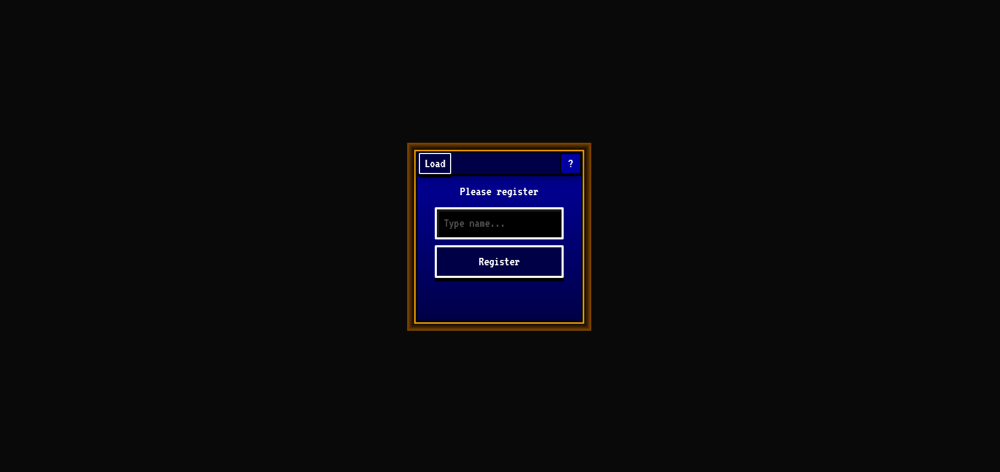
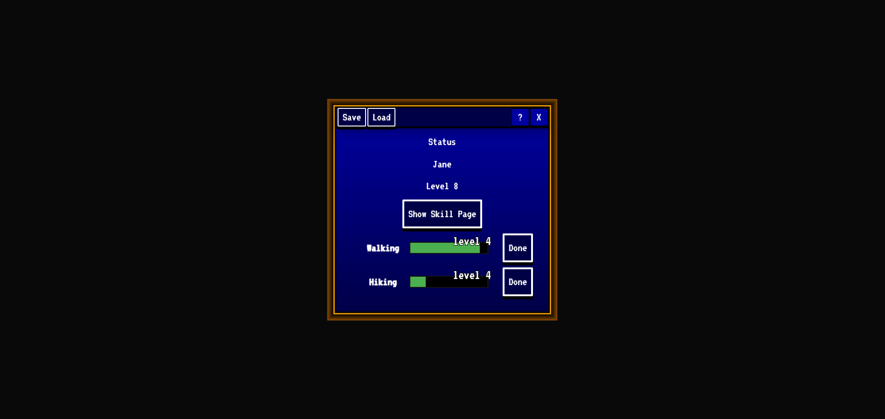
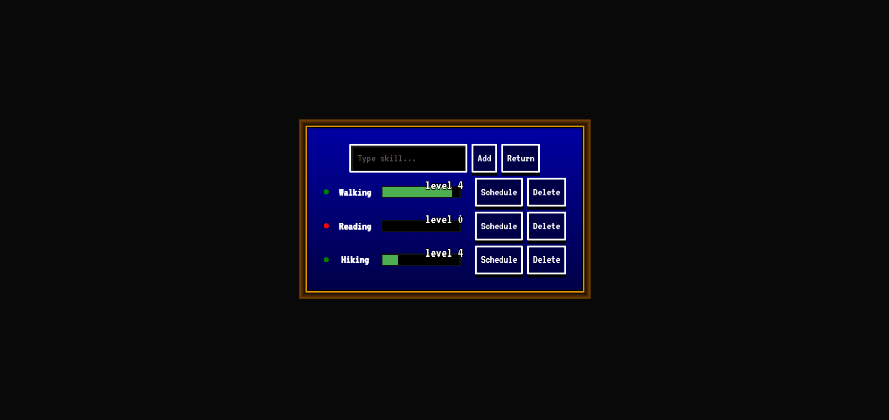

# To Do Quest

This is a web application that allows users to complete and keep track of their to do list in a game like fashion. Users can add or remove skills, schedule them, export or import their data and more.

Detailed instructions can be found below.

This README is still being edited and under further review.

## Technology used

This application was done using TypeScript React with Vite, making use of all the modern React features.

## How to use

Below is a quick summary on how to use the application.

#### Login/Registration Page



When the user first enters the application they will face a registration page. Here they can either register a new username or load a previous save file. There is also a question mark on the top right corner which can be clicked for more information.

#### Home Status Page



After either logging in or registering, the user will face the home status page. Here the user can view their registered username, their overall general level, a button which will take them to the skill page and a list of their skills.

On top left is the save and load buttons, which will help you export or import your current user data. On top right is the question mark button which can be clicked for more information. Next to that is the X symbol, which when clicked will delete your current data. Make sure to export your data before doing this if you do not wish to lose it.

The skill list itself is composed of skills, which include their name, a Done button and a experience bar, alongside a skill proficiency level.

Clicking the Done button signals the task has been completed and gives you a set amount of experience, which will level your skill up. The higher your level is the more difficult it becomes to level your skill up. The bar is there to show your experience progress on your current level.

Your overall general level is composed of the sum of all your skill levels.

#### Skill Page



Clicking the Show Skill Page button takes you to the Skill Page, iou can add or delete skills in this page alongside other things.

Writing a skill and clicking Add will add the skill to your user profile. You can also click Return to return to the Home Status Page.

Below those buttons lays all of your skills. You can delete them here permanently, Schedule them so they show up on the Home Status Page or click on the Skill name to change it.

## How it functions

I will briefly explain how the application functions.

The application uses React with TypeScript, it also makes use of modern React technologies.

Starting with the App.tsx, we make use of Router, which navigates to two routes, the Home Status Page and the Skill Page.

The Router file (router.tsx) is also the place where we place our uplifted userState state. We make use of Outlet and Context to send this state between pages.

We have the utility folder, which contains some small utility files and functions.

- The config.ts file contains key to local storage, which we will mention more later.

- The helpers.ts file contains functions that work with the browser's local storage to import or export them and interacts with file selectors.

- The react-env.d.ts file declares react module for TypeScript types, which is used to prevent warning/error from TypeScript when working with odd HTML elements.

- The types.ts file contains all the types for the project.

We also have a styles folder, which contains variables and CSS reset.

Then there is the last relevant folder, which is the pages folder. It contains the React Pages and Components.

The application revolves around by the main state, which is userState and the local storage data, which is a copy of the userState in browser memory.

The Home.tsx file contains the handlers for deleting user profile, exporting or importing save data, navigation to Skill Page and conditional rendering of login page (which is actually just a component) if the user is not logged in.

The individual skills in Home.tsx and SkillPage.tsx are a component of its own called LevelBar.

The SkillPage.tsx contains handlers for adding proficiency, returning back to the home status page and changing the skill name.

As for components, there is the previously mentioned LevelBar, PopUp, which is for the question mark help button and UserLogin.

Among these perhaps the LevelBar component is the most important and relevant one, so I will only explain that in more detail. PopUp.tsx component is too short and straightforward to need any explanation, meanwhile UserLogin.tsx component allows the user to login/register and save the user data to local storage.

LevelBar.tsx component itself contains the logic for increasing skill proficiency, deleting skills, calculating the math required for skills to level up, turning raw experience points into legible levels, adjusting the experience bar and much more.

The last thing worth mentioning again is the userState and the local storage user data, which is a copy of that userState. This object looks like so:

```
{
"name": "Default",
"level": 1,
"skills": {
    "test2": 70
  },
"schedule": {
    "test2": 1
  }
}
```

The name and level is obvious, skills contains a list of skills and their experience and the schedule contains the same skill and a boolean which decides to either show the skill on home status page or not.

Overall, the application mainly works by manipulating the internal React state and external browser local storage. The game aspect of the application is achieved by combining to do list features with leveling up. The application's overall look and use also mirrors a JRPG, which helps make it work.

The application is semi finished but it still lacks some features you would expect from more advanced to do list applications. Those might be worked on at a later time.
